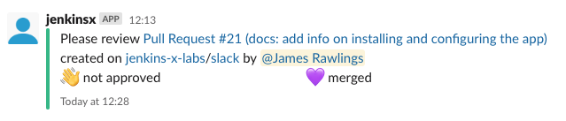
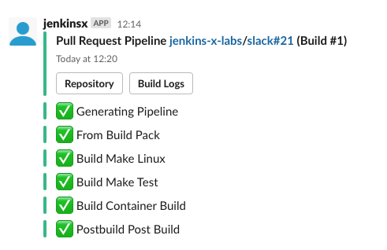
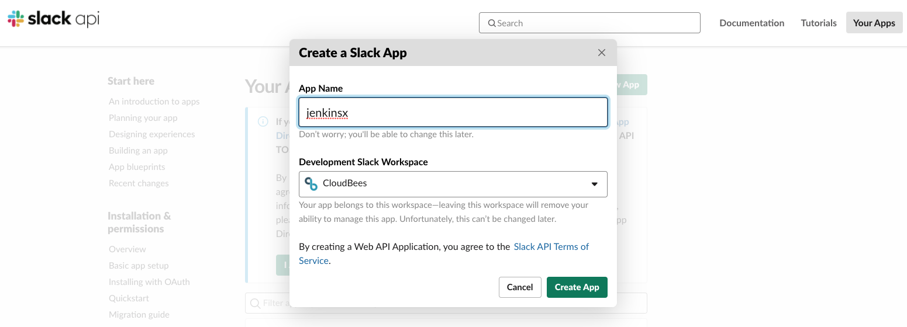
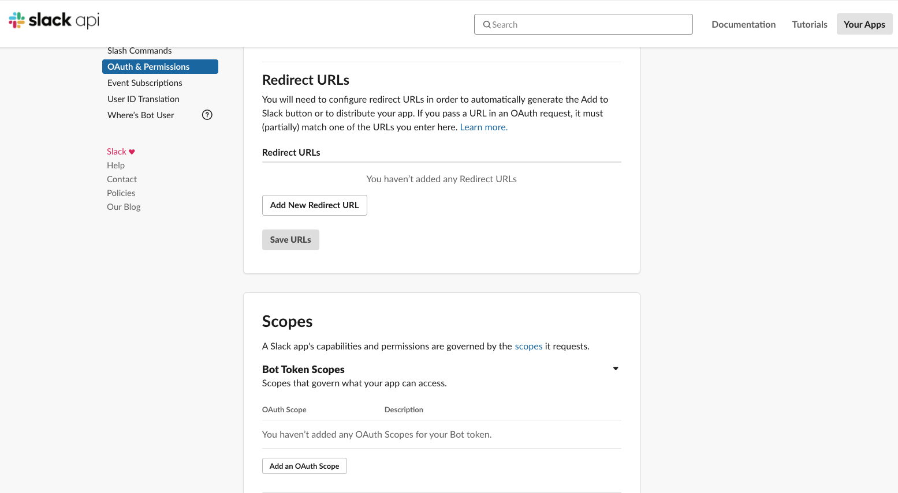
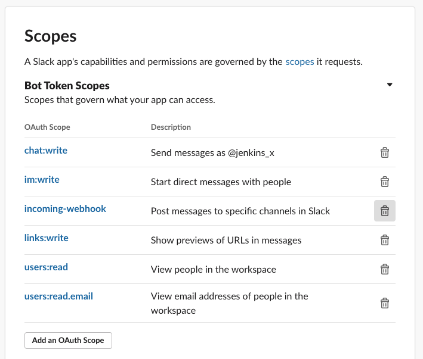

# slack - VERY EARLY ALPHA

WARNING: This is an experimental Jenkins X Labs project, it is likely to have significant change and APIs may break while
we gather feedback and aim to get it into an alpha state.

The Slack app for Jenkins X provides integration with Jenkins X and Slack, originally authored at CloudBees by Pete Muir

This has been developed and tested so far using pipelines triggred by commits from GitHub and deployed using Jenkins X on Google Container Engine.

## Features

* Sends a message when a build starts on any of the projects inside the cluster updating the message in real time as your pipeline progresses. Works for both pipelines and releases. Can be a DM or to a room.



* Sends a message when a Pull Request is created, CC'ing the reviewers allocated and updates the message as the PR gets approved/merged. Can be a DM or to a room. Message gets updated as PR status changes (e.g. builds passing, merged etc.)



## Future ideas
* Can be configured to send failure messages when release pipelines fail
* Integrate with traceability

## Feedback

Got any great ideas we can add to the Slack App? If so [Raise a issue here](https://github.com/jenkins-x-labs/issues)

## Install the app

```bash
jx add app slack --repository=https://jenkinsxio-labs.storage.googleapis.com/charts
```
Alternatively if you are using helm 3 and or the [labs boot](https://jenkins-x.io/docs/labs/boot/) approach then until the jx apps commands have been updated to work with helm 3 you can install by adding to your `jx-apps.yml`

```yaml
apps:
- name: slack
  repository: https://jenkinsxio-labs.storage.googleapis.com/charts
```

## Configure the app

1. For now the slack bot has not been distributed publically on the marketplace so lets start by creating an app integratiom in Slack:

https://api.slack.com/apps?new_app=1



Once created from the left hand menu select "OAuth & Permissions" and scroll down to the "Scopes section".



2. Add the following Bot Token Scopes:



3. Next, at the top of the "OAuth & Permissions" page select "Request to install" the App.  This will need to be approved by a Slack administrator.  Once approved you can copy the "Bot User OAuth Access Token" from the top of the same Oauth & Permissions page and use it in the next step.

4. Now using that Slack token create a Kubernetes secret:
```bash
kubectl create secret generic test-slack-bot-secret --from-literal=token=abc123
```

5. Invite your new slack app to the channel you want your room messages to appear in
```
/invite jenkinsx
```
6. Our Jenkins X Slack Bot app is configured using a custom resources of kind `SlackBot`. For example:
Next configure and apply your slack bot configuration referencing the secret above:

```yaml
kind: SlackBot
apiVersion: slack.app.jenkins-x.io/v1alpha1
metadata:
  name: test-slack-bot
spec:
  pipelines:
  - directMessage: true
    orgs:
    - name: cheese
    - name: meat
  pullRequests:
  - channel: vegetables
    notifyReviewers: true
    orgs:
    - name: vegetables
      repos:
      - carrots
  - channel: brassicas
    notifyReviewers: true
    orgs:
    - name: vegetables
      repos:
      - cabbage
      - brussel_sprouts
  namespace: jx
  tokenReference:
    kind: Secret
    name: test-slack-bot-secret
```

Each integration is configured in a separate custom resource. To add a new integration, create
a new custom resource.

7. The slack bot app will use a Git commit email address when Pull Requests and other Git events happen.  This Git email address is used to lookup a Slack user id which is then used to send Direct messages to.  If the email addresses got your users git commits is different to the one they use to log into slack you will need to provide the mappings.

A user mapping file is a simple plain text file containing a list of git email adresses that map to their slack email address.

Example:
```
cat  ~/.jx/localSecrets/mapping.txt
james@gmail.com:james@wine.com
fred@hotmail.com:fred@wine.com
```

Now recreat a Kubernetes secret containing the base64 encoded data from the contents of the mapping.txt file above.

kubectl delete secret slack-users
kubectl create secret slack-users --from-file ~/.jx/localSecrets/mapping.txt


Alternatively if you are using Google Secrets manager and the Jenkins X [gsm controller](https://github.com/jenkins-x-labs/gsm-controller) simply add the mapping file with:
```
gcloud beta secrets create slack-users --replication-policy automatic --project jenkinsxio-labs --data-file=/Users/jamesrawlings/.jx/localSecrets/mapping.txt
```
And make sure you enable the `googleSecretsManager: true` helm value when installing this slack bot helm chart.

## Development

The slack app was developed against a cluster using Helm 3, for faster iterations you can run...
```bash
./build-deploy.sh
```

_Note_ this is just for testing as it does not integrate with Jenkins X GitOps
